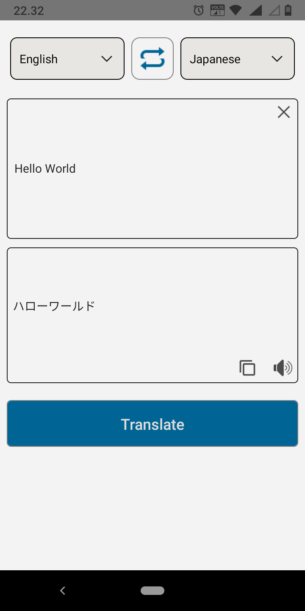
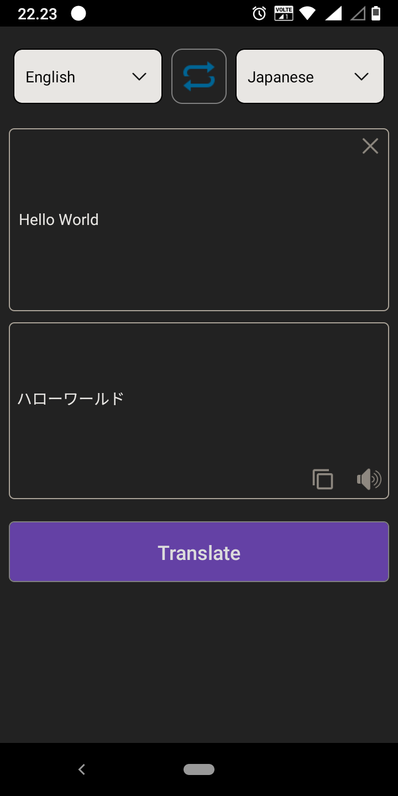

# DeepL Translator For Mobile

### Language translator that uses DeepL API interface for high-quality tranlations.  
 

The DeepL API is accessible with either the [DeepL API Free](https://www.deepl.com/pro#developer) or the [DeepL API Pro](https://www.deepl.com/pro#developer) plan. The DeepL API Free plan allows developers to translate up to 500,000 characters per month for free. For more advanced needs, the DeepL API Pro plan allows unlimited translation, maximum data security, and a prioritized execution of translation requests.

You need an authentication key to access to the API

[DeepL API documentation](https://www.deepl.com/docs-api/translating-text/request/)  

## Screenshots
light & dark theme

 